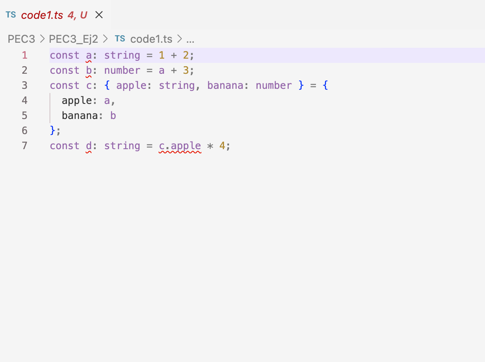

# code1

En la imagen anterior se muestran los errores que muestra el IDE sobre el codigo TypeScript.

La ventaja de este tipo de errores es que se pueden ver a la hora de escribir codigo y por tanto corregirlos antes de que el codigo se tenga que compilar.

De esta manera para el desarrollador es mas ameno y no se corre ningun riesgo de que el codigo se despliegue con los errores.

# code2

TypeScript infiere valores basado en el valor literal, en la estructura del objeto o los valores literales.

- a se infiere como numero porque el valor es un numero
- b como string porque esta entre ''
- c como string por la misma razon
- d como boolean[] porque es una lista ([]) y todos los valores son boolean
- e como { type: string } porque la estructura es un objeto y el valor es de tipo string
- f como (number | boolean)[] porque es una lista pero puede tener numeros o boolean
- g como number[] porque es una lista de numeros
- h es null porque el valor es nulo

# code3

El primer error sucede porque la variable i se declaro como constante y por tanto no se puede cambiar.

El segundo error es porque el array se declara como number[] y por tanto no puede contener strings.

El tercer error sucede porque la variable se declara como tipo never que significa que no puede tener ningun valor.

El cuarto error sucede porque las variables de tipo unknown no se pueden usar en operaciones hasta que se conozca su tipo.

# Clase vs interfaz

En TypeScript las clases y las interfaces ambas se utilizan para definir la estructura de objetos.

La diferencia es que los interfaces son contratos mientras que las clases son implementaciones.

Por tanto las clases se pueden instanciar y las interfaces no. Cuando se debe implementar un contrato (una especificacion) que pueda ser implementada por clases es necesario usar un interfaz.